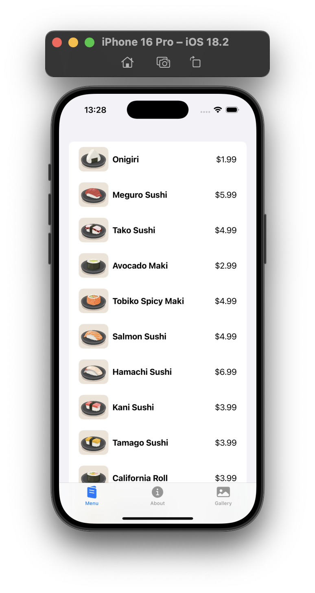
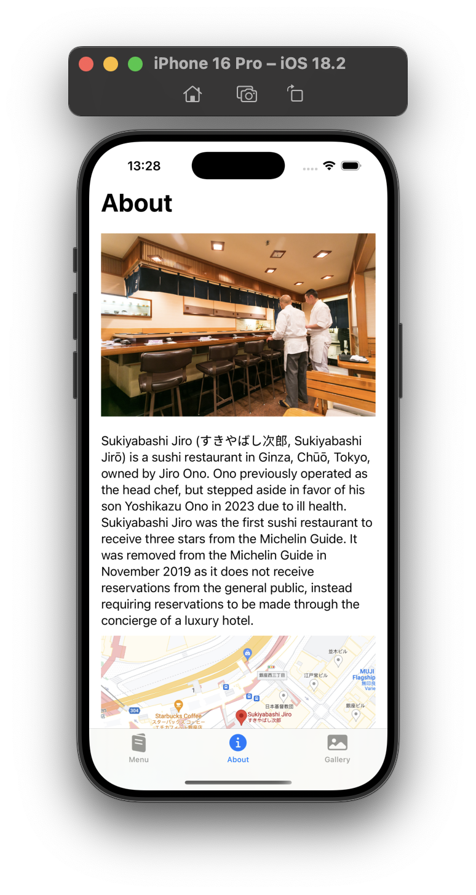
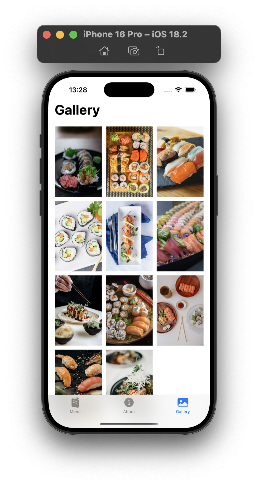

    
    
    

## Development Environment
- Xcode 15+
- iOS 17.0+
- Swift 5.9

## SwiftUI Components & Features
- `LazyVGrid` - For grid-based layouts
- `NavigationStack` - For navigation management
- `TabView` - For tab-based navigation
- `AsyncImage` - For asynchronous image loading
- `PhotosPicker` - For native photo gallery integration
- `ScrollView` - For scrollable content
- `List` & Custom List Rows
- `Image` & `ImageRenderer`
- `State` & `StateObject` - For state management
- `Binding` - For two-way data binding
- `View Modifiers` - For UI customization
- `Sheet` Presentations
- Custom View Components

## Architecture & Design
- MVVM (Model-View-ViewModel) Architecture
- Swift Package Manager
- Protocol-Oriented Programming
- Data Services Pattern